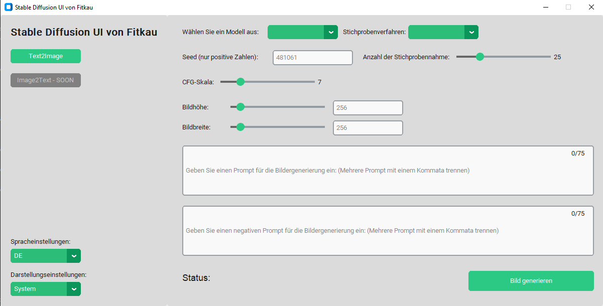

<a name="readme-top"></a>

<br />
<div align="center">
  <a href="https://github.com/kfitkau/">
    
  </a>

<h3 align="center">Simple Stable Diffusion UI with Customtkinter</h3>

  <p align="center">
    Stable Diffusion UI is a user-friendly interface built upon StabilityAi's groundbreaking Stable Diffusion technology
  </p>
</div>


<!-- TABLE OF CONTENTS -->
<details>
  <summary>Table of Contents</summary>
  <ol>
    <li>
      <a href="#about-the-project">About The Project</a>
      <ul>
        <li><a href="#built-with">Built With</a></li>
      </ul>
    </li>
    <li>
      <a href="#getting-started">Getting Started</a>
      <ul>
        <li><a href="#prerequisites">Prerequisites</a></li>
        <li><a href="#installation">Installation</a></li>
        <li><a href="#usage">Usage</a></li>
      </ul>
    </li>
    <li><a href="#license">License</a></li>
  </ol>
</details>


<!-- ABOUT THE PROJECT -->
## About The Project

Stable Diffusion UI is a user-friendly interface built upon StabilityAi's groundbreaking Stable Diffusion technology.<br/>
The UI was made with Customtkinter

<p align="right">(<a href="#readme-top">back to top</a>)</p>


### Built With

* [![Python][python.org]][python-url]
* [Customtkinter](https://customtkinter.tomschimansky.com/)

<p align="right">(<a href="#readme-top">back to top</a>)</p>


<!-- GETTING STARTED -->
## Getting Started
### Prerequisites

Python 3.9 or later installed on your system.<br/>
Git installed to clone the repository.

```diff
@@ For the exe you don't need Git or Python @@
```

### Installation

1. Clone the Repository:
   ```sh
   git clone https://github.com/kfitkau/my-projects.git
   ```
2. Navigate to the Project Directory:
   ```sh
   cd stable-diffusion-ui
   ```
3. Install Dependencies:
   <br/>(I would recommend creating a virtual environment with `python -m venv venv` and activate with `.\venv\Scripts\activate`)
   ```sh
   pip install -r requirements.txt
   ```

<p align="right">(<a href="#readme-top">back to top</a>)</p>

### Usage

1. Run the Application:
   ```sh
   python app.py
   ```
2. Access the UI:
  <br/>The program opens with the gui. Write a prompt, select all parameters and generate a picture
3. Parameter to click in the GUI:
   - model: Select the model version
   - sampling method: The scheduler controls the entire denoising process in which the model generates (diffuses) the image.
   - seed: A seed is a way of initializing the random number generator that is used to generate the image. It lets you reproduce the same result when you want to.
   - sampling steps: Sampling steps is the number of iterations that Stable Diffusion runs to go from random noise to a recognizable image based on the text prompt.
   - CFG Scale: CFG scale (classifier-free guidance scale) or guidance scale is a parameter that controls how much the image generation process follows the text prompt. The higher the value, the more the image sticks to a given text input.
   - Picture Height:  Select the picture height either using a slider or by directly inputting a number.
   - Picture Width:  Select the picture width either using a slider or by directly inputting a number.
   - text (prompt): A text prompt is a brief written instruction or query provided to guide or initiate a response
   - text (negative prompt): A negative prompt is a written instruction that guides the generation of content by discouraging or steering the AI model away from certain topics, concepts, or tones.
   - button (generate Image): Once all the necessary parameters have been selected, the image is generated

<p align="right">(<a href="#readme-top">back to top</a>)</p>

If you encounter any issues during installation or usage, refer to the project's documentation or GitHub repository for troubleshooting tips.<br/>
Make sure to check for any specific configuration options or environment variables that might be required for the application to run smoothly.<br/>
This guide assumes a basic setup. For advanced usage or customization, consult the project's source code.

### Resources
[Stability AI Website](https://stability.ai/)<br/>
[Customtkinter](https://customtkinter.tomschimansky.com/)

<!-- LICENSE -->
## License

Distributed under the MIT License. See `LICENSE.txt` for more information.

<p align="right">(<a href="#readme-top">back to top</a>)</p>


<!-- MARKDOWN LINKS & IMAGES -->
[python.org]: https://img.shields.io/badge/Python-%3E%3D3.9-blue
[python-url]: https://python.org 
